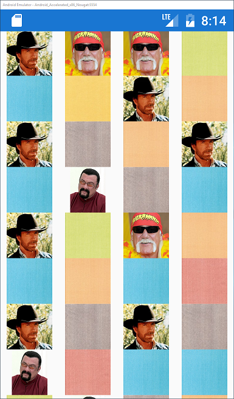

# glidex and glidex.forms
glidex is a minimalist Xamarin.Android binding of Glide found at https://github.com/bumptech/glide

glidex.forms is a prototype of what we can do to improve Xamarin.Forms image performance on Android. See my post on the topic [here](http://jonathanpeppers.com/Blog/xamarin-forms-performance-on-android).

Download from NuGet (use the Prerelease checkbox):

| glidex | glidex.forms |
|---|---|
| [](https://www.nuget.org/packages/glidex) | [](https://www.nuget.org/packages/glidex.forms) |

We don't want or care to bind the entirety of Glide's public API surface. Our goal here is to just bind the "useful" APIs for Glide.

For example take the following C#:
```csharp
var image = FindViewById<ImageView> (Resource.Id.testImage);
Glide.With (this)
    .Load ("https://botlist.co/system/BotList/Bot/logos/000/002/271/medium/chuck_norris.jpg")
    .Apply (RequestOptions.CircleCropTransform ().Placeholder (Android.Resource.Drawable.IcMenuCamera))
    .Into (image);
```

This code loads an image from a URL dynamically, taking care of all of Glide's cool caching functionality. These are the only APIs we need to make the library useful.

If you have a "classic" Xamarin.Android app that is not Xamarin.Forms, you can use the `glidex` NuGet package if desired.

_glidex is currently using the 4.6.1 release of Glide from Github_

# glidex.forms for Xamarin.Forms on Android

The entire goal is to get fast Images for Xamarin.Forms on Android by using Glide.

I created two custom renderers to achieve this:
- `Android.Glide.ImageRenderer` - ported from the "fast" XF `ImageRenderer`
- `Android.Glide.ImageCellRenderer` - a standard `CellRenderer` that hooks into Glide for images

This library won't use `IImageSourceHandler` at all, it flat out ignores it. `IImageSourceHandler`'s return value of `Task<Android.Graphics.Bitmap>` doesn't line up with Glide's APIs which uses `ImageView` directly.

But to set this library up in your existing project, merely:
- Add the `glidex.forms` NuGet package
- Add this one liner after your app's `Forms.Init` call:

```csharp
Xamarin.Forms.Forms.Init (this, bundle);
//This forces the custom renderers to be used
Android.Glide.Forms.Init ();
LoadApplication (new App ());
```

If you want to customize how Glide is used in your app, right now you can:
- Subclass `Android.Glide.ImageRenderer` or `Android.Glide.ImageCellRenderer`
- Override `UpdateImage` and use the various `protected` members as needed
- Use the `glidex` Java binding directly as you prefer

# Comparing Performance

It turns out it is quite difficult to measure performance improvements specifically for images in Xamarin.Forms. Due to the asynchronous nature of how images load, I've yet to figure out good points at which to clock times via a `Stopwatch`.

So instead, I found it much easier to measure memory usage. I wrote a quick class that runs a timer and calls the Android APIs to grab memory usage.

Here is a table of peak memory used via the different sample pages I've written:

| Page             | Loaded by     | Peak Memory Usage |
| ---              | ---           | ---:              |
| GridPage         | Xamarin.Forms |       268,387,112 |
| GridPage         | glidex.forms  |        16,484,584 |
| ViewCellPage     | Xamarin.Forms |        94,412,136 |
| ViewCellPage     | glidex.forms  |        12,698,112 |
| ImageCellPage    | Xamarin.Forms |        24,413,600 |
| ImageCellPage    | glidex.forms  |         9,977,272 |
| HugeImagePage    | Xamarin.Forms |       267,309,792 |
| HugeImagePage    | glidex.forms  |         9,943,184 |

_NOTE: I believe these numbers are in bytes. I restarted the app (release mode) before recording the numbers for each page. Pages with ListViews I scrolled up and down a few times._

Stock XF performance of images is poor due to the amount of `Android.Graphics.Bitmap` instances created on each page. Disabling the Glide library in the sample app causes "out of memory" errors to happen as images load. You will see empty white squares where this occurs and get console output.

To try stock Xamarin.Forms behavior yourself, you can remove the references to `glidex` and `glidex.forms` in the `glide.forms.sample` project and comment out the `Android.Glide.Forms.Init()` line.

# Features

In my samples, I tested the following types of images:
- `ImageSource.FromFile` with a temp file
- `ImageSource.FromFile` with `AndroidResource`
- `ImageSource.FromResource` with `EmbeddedResource`
- `ImageSource.FromUri` with web URLs
- `ImageSource.FromStream` with `AndroidAsset`

For example, the `GridPage` loads 400 images into a grid with a random combination of all of the above:

